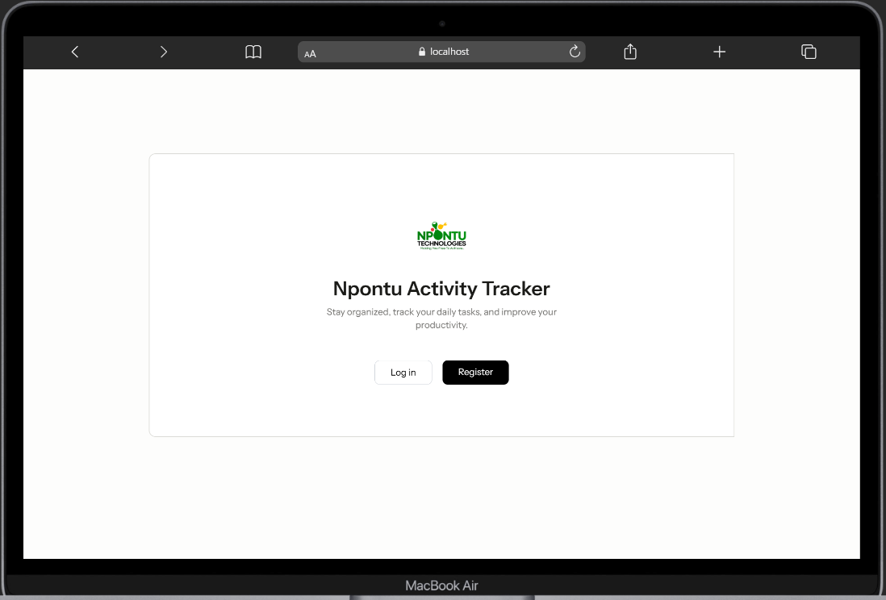
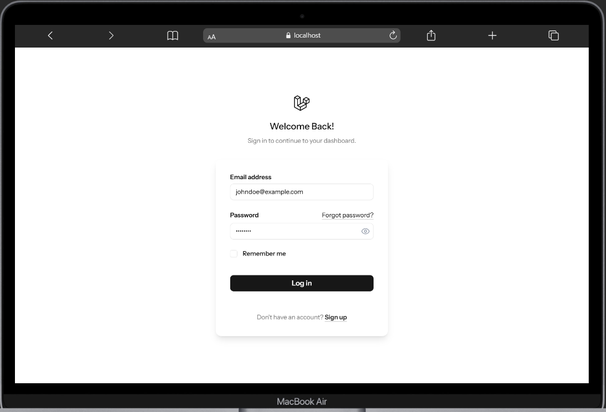
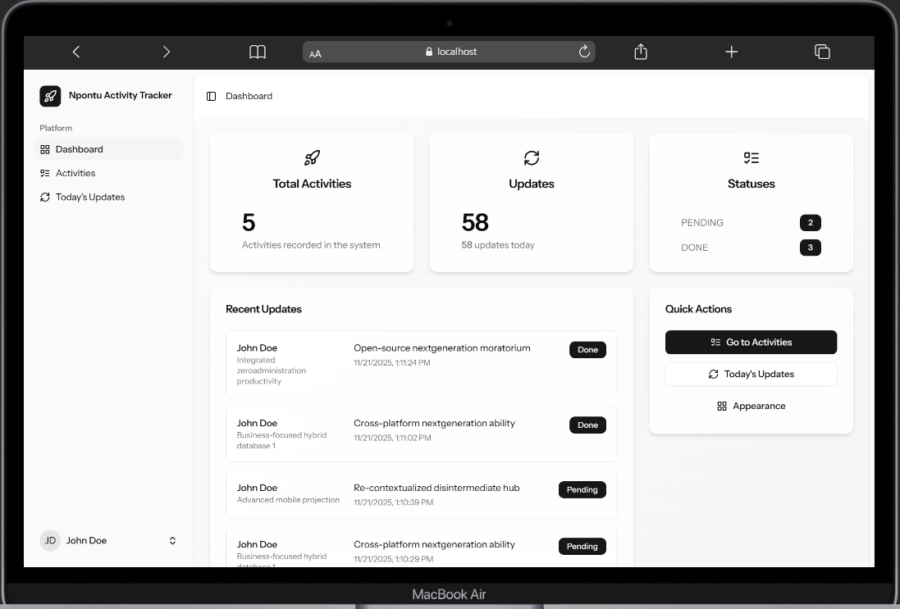
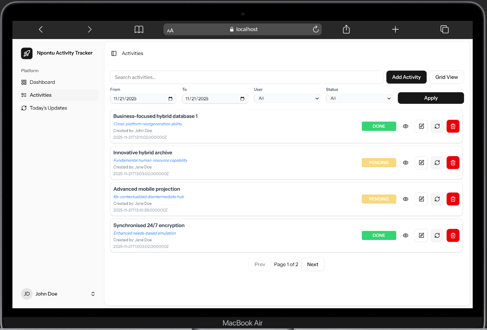
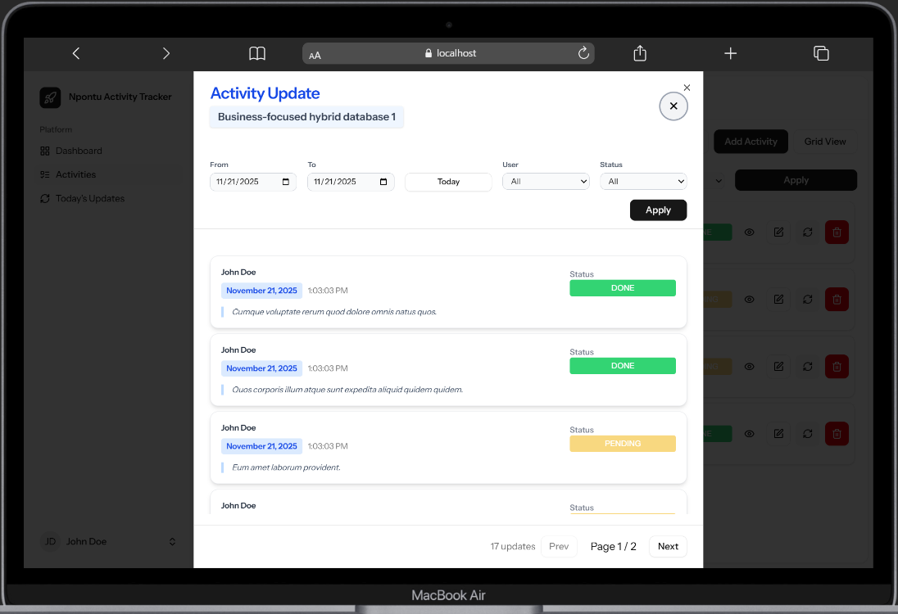

# Daily Activities Tracker

[**Explore the docs »**](https://github.com/SedemHoggarOfficial/Npontu-Activity-Tracker)

A simple web application built with the Laravel framework to help users track their daily activities.

## About The Project

This project provides a platform for users to log and manage their daily tasks or activities. Each activity can have a title, a detailed description, remarks, and a status. This helps in keeping a structured record of work done over time. Any time an update is made to the activities, a record is kept of that update.

Note: The project used React Starter kit

## Sample UI Screenshots

Here are some screenshots of the application in action:








### Built With

*   [Laravel](https://laravel.com/)
*   [PHP](https://www.php.net/)
*   [Composer](https://getcomposer.org/)
*   [Node.js](https://nodejs.org/)
*   [React.js](https://react.dev/)
*   A SQL database (e.g., MySQL, PostgreSQL)

## Getting Started

To get a local copy up and running, follow these simple steps.

### Prerequisites

Make sure you have the following software installed on your machine:
*   PHP (>= 8.1)
*   Composer
*   Node.js and npm
*   A database server (e.g., MySQL)

### Installation

1.  **Clone the repository**
    ```sh
    git clone https://github.com/SedemHoggarOfficial/Npontu-Activity-Tracker.git
    cd Npontu-Activity-Tracker
    ```

2.  **Install dependencies**
    ```sh
    composer install
    npm install
    ```

3.  **Set up your environment file**
    Create a copy of the `.env.example` file and name it `.env`.
    ```sh
    cp .env.example .env
    ```

4.  **Generate an application key**
    ```sh
    php artisan key:generate
    ```

5.  **Configure your database**
    This project is configured to use SQLite by default, which requires no extra database server setup. The database file will be created automatically.

6.  **Run database migrations**
    This command will create your database tables and populate them with sample data.

    > **Important!**
    > Running the seeder will create two sample users and their associated activities. You can log in with:
    > - **User 1:** `johndoe@example.com` | **Password:** `password`
    > - **User 2:** `janedoe@example.com` | **Password:** `password`

    ```sh
    php artisan migrate:fresh --seed
    ```

7.  **Start the development server**
    In one terminal, run the PHP server:
    ```sh
    php artisan serve
    ```
    ```sh
    npm run dev
    ```
    ```sh
    composer run dev
    ```
    The application will be available at `http://127.0.0.1:8000`.

## License

Distributed under the MIT License. See `LICENSE` for more information.